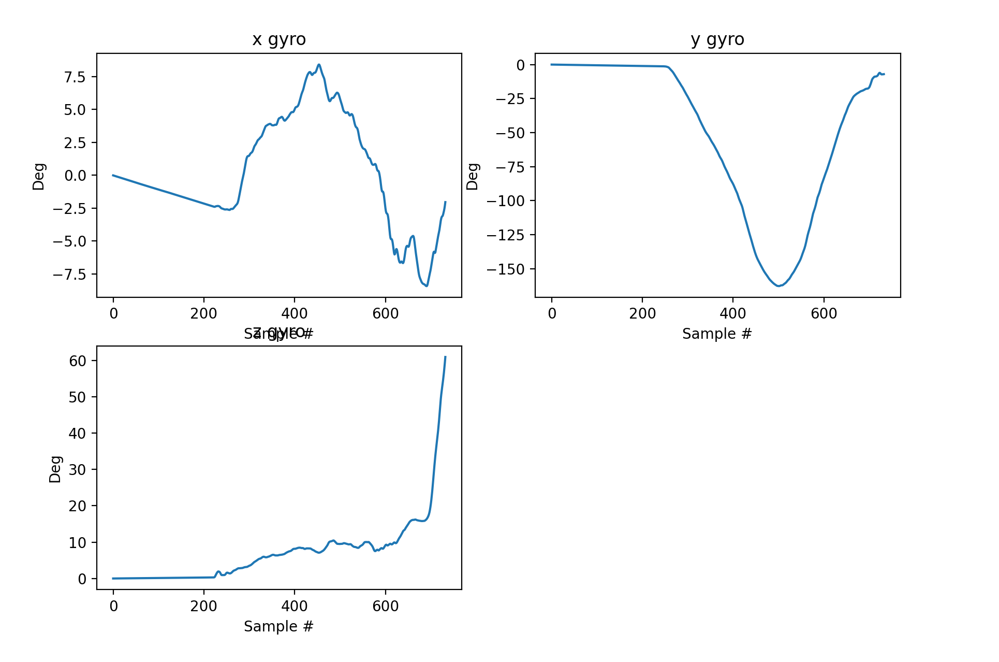
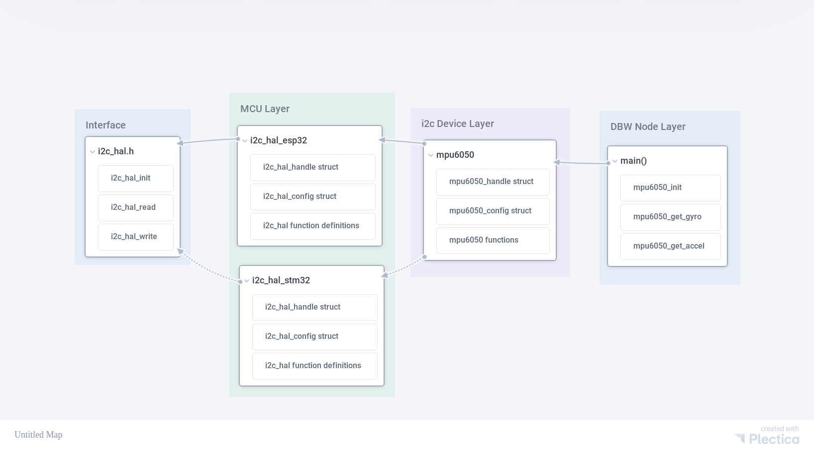

# IGVC VIP FA24 Work/Guide

The goal of this semester's work in VIP was to tackle the intricacies regarding
a Hardware Abstraction Layer (HAL) and begin the proof of concept and design of
a HAL within the selfdrive repo.

*The selfdrive directory present in this repository is just a skeleton of the
actual selfdrive repo. This skeleton only contains the relevant code written
for this project.

## EMBER
At its current status, [EMBER](https://github.com/CooperUnion/ember) is not
actually a hardware abstraction layer. Mainly, it consists of a bunch of wrapper
functions regarding the rate-tasking and watchdog within the freertos.

### Problem Statement
Currently, the entire selfdrive repo is designed around the esp-idf framework.
In other words, all of our code for DBW can only run on the esp32s3
microcontroller. Obviously, if we ever want to switch micros into something more
robust like a stm32 or pico, we would have to rewrite all our drivers to fit the
demands and constraints of the respective hardware. Instead of having to always
rewrite drivers over and over again, why not write a HAL interface, which users can
extend their drivers off of, and ultimately have the HAL abstract away the
hardware constraints such that the drivers can remain the same!

## The MPU6050 Driver

Before beginning writing the actual HAL, the mpu6050, a fairly simple i2c sensor
was chosen to write a driver for. The procedure was as follows:

First, the selfdrive repo does not have a proper directory or library for
drivers. Instead, the drivers & libraries written by ESP-IDF are used and configured
directly within the components themselves. Take the ADC peripheral in the
brake-by-cable `bbc` component, for example. The ADC is configured manually
within the `bbc.c` file and solely depends on the functionality of the ESP32
adc-continuous driver provided by ESP-IDF. As a temporary addition (later will
be ported over the EMBER repo), a `drivers/` directory was created under
`selfdrive/lib/`

The structure for setting up this driver library is as follows:
```
selfdrive/
├── components
│   └── fk
│       ├── component.toml
│       ├── SConscript.py
│       └── src
│           ├── main.c
│           └── SConscript.py
└── lib
    └── drivers
        ├── mpu6050
        │   ├── mpu6050.c
        │   ├── mpu6050.h
        │   └── SConscript.py
        └── SConscript.py
```

It is important to note that a separate `fk` component was created and linked to
the drivers library to test and use the mpu6050 driver. The interested reader
can refer to the actual source code for the mpu6050 driver within this repo. The
driver for the mpu6050 was initially written using the ESP-IDF `<i2c_master.h>`
library with the
[datasheet](https://cdn.sparkfun.com/datasheets/Sensors/Accelerometers/RM-MPU-6000A.pdf)
referenced. Simple i2c devices and pre-written mpu6050 drivers such as the
libdriver [libdriver/mpu6050](https://github.com/libdriver/mpu6050/tree/main)
were also referenced when writing the first driver.

Essentially, the mpu6050 driver is fundamentally laid on-top of an i2c driver
that manages all the transactions. Writing a low-level i2c driver would be out
of scope of this project and thus the ESP-IDF `<i2c_master.h>` i2c driver was used
as the base starting point. It is important to note the functionality of the i2c
communication protocol. The interested reader can refer to
[i2c](https://www.ti.com/lit/pdf/sbaa565) to learn more. Simply put, the
'master' DBW node must communicate with the 'slave' mpu6050 device using the
functions provided by the i2c driver to configure and initialize the mpu6050
device, and acquire sensor data, specifically gyro and accelerometer in this
case.

In the context of the ESP-IDF `<i2c_master.h>` driver, the `i2c_master_transmit`
and `i2c_master_transmit_recieve` functions are responsible for handling the
transactions between the mcu and i2c device. More detail about the ESP-IDF i2c
driver and peripheral can be found here: [ESP-IDF I2C
Peripheral](https://docs.espressif.com/projects/esp-idf/en/stable/esp32s3/api-reference/peripherals/i2c.html#_CPPv418i2c_master_receive23i2c_master_dev_handle_tP7uint8_t6size_ti).

Brief testing of the gyro functionality of the mpu6050 driver can be seen here:

The gyro was rotated in ~ -150 degrees and back in y and ~ 60 degrees in z direction.


## The Hardware Abstraction Layer

Once the foundational driver for the mpu6050 was written, the i2c portions were
all abstracted away to preserve the functionality of the mpu6050 and the
portability of the i2c driver used in the mpu6050, thus a HAL for the i2c device
was made. The interface is designed as follows in `i2c_hal.h`.

```
typedef struct i2c_hal_handle_s i2c_hal_handle_t;
typedef struct i2c_hal_config_s i2c_hal_config_t;

typedef struct {
	void (*i2c_hal_init)(i2c_hal_handle_t *i2c_hal_handle,
		i2c_hal_config_t	      *i2c_hal_config);
	void (*i2c_hal_read)(i2c_hal_handle_t *i2c_hal_handle,
		const uint8_t		       addr,
		uint8_t			      *data,
		uint32_t		       num_bytes);
	void (*i2c_hal_write)(i2c_hal_handle_t *i2c_hal_handle,
		const uint8_t			addr,
		uint8_t			       *data,
		uint32_t			num_bytes);
} i2c_hal_t;
```

It is important to note that the user must define the core functionality of the
i2c device:

- `i2c_hal_init()`
- `i2c_hal_read()`
- `i2c_hal_write()`

In a separate `i2c_hal_<mcu>.c` file that interfaces with the microcontroller of
interest. For example, since we use the ESP32, the function declarations in the
interface are implemented in `i2c_hal_esp32.c`. Note that this contains the
"esp-idf i2c way" to initialize, read, and write from the i2c device. If an
alternative, such as the STM32, was used, a separate `i2c_hal_stm32.c` would be
created with the same function definitions, but most likely a separate
implementation using different i2c transmit commands that work with its own
respective low-level i2c driver.

*For the sake of being able to compile the build environment without
overcomplicating the selfdrive repo by creating another sublibrary directory
called `HAL/` in the `lib/` directory, all relevant hal code was also
temporarily kept in the mpu6050 library in the actual selfdrive repo.

Ideally the structure as presented in this repo would be illustrated as follows:

```
selfdrive/
├── components
│   └── fk
│       ├── component.toml
│       ├── SConscript.py
│       └── src
│           ├── main.c
│           └── SConscript.py
└── lib
    ├── drivers
    │   ├── mpu6050
    │   │   ├── mpu6050.c
    │   │   ├── mpu6050.h
    │   │   └── SConscript.py
    │   └── SConscript.py
    └── ember
        └── hal
            ├── i2c_hal_esp32.c
            ├── i2c_hal_esp32.h
            └── i2c_hal.h
```

In essence, if one wanted to use the same mpu6050 driver with a different mcu
such as the stm32, a separate `i2c_hal_stm32` files would be created with a
different implementation of the i2c driver, but same functionality.

Furthermore, if one wanted to create a driver for an i2c device that was
different from the mpu6050, the driver would extend off of the `i2c_hal_<mcu>`
layer and use the core necessary i2c functions being init, read, and write.

As shown below, the `i2c_hal_esp32.h` header file would look something like this:
```
#include "i2c_hal.h"
#include <driver/i2c_master.h>
#include <freertos/FreeRTOS.h>

struct i2c_hal_handle_s {
	i2c_master_dev_handle_t dev_handle;
};

struct i2c_hal_config_s {
	uint8_t	 device_address;
	uint32_t scl_speed_hz;
	uint8_t	 scl;
	uint8_t	 sda;
};

void i2c_hal_init(
	i2c_hal_handle_t *i2c_hal_handle, i2c_hal_config_t *i2c_hal_config);
void i2c_hal_read(i2c_hal_handle_t *i2c_hal_handle,
	const uint8_t		    addr,
	uint8_t			   *data,
	uint32_t		    num_bytes);
void i2c_hal_write(i2c_hal_handle_t *i2c_hal_handle,
	const uint8_t		     addr,
	uint8_t			    *data,
	uint32_t		     num_bytes);
```

Consequently, the mpu6050 `mpu6050.h` header file would look something like
this:

```
#include "i2c_hal_esp32.h"

// Other typedefs have been omitted for readabilty of the core functionality of
// this header file. Refer to the actual i2c_hal_esp32.h file to see the full
// code

typedef struct mpu6050_handle_s {
	i2c_hal_handle_t i2c_hal_handle;
} mpu6050_handle_t;

typedef struct mpu6050_config_s {
	i2c_hal_config_t  i2c_hal_config;
	mpu6050_fs_sel_t  fs;
	mpu6050_afs_sel_t afs;
	gpio_num_t	  scl;
	gpio_num_t	  sda;
} mpu6050_config_t;

void mpu6050_init(
	mpu6050_handle_t *mpu6050_handle, mpu6050_config_t *mpu6050_config);
void mpu6050_get_raw_accel(
	mpu6050_handle_t *mpu6050_handle, mpu6050_raw_accel_t *accel_raw_val);
void mpu6050_get_raw_gyro(
	mpu6050_handle_t *mpu6050_handle, mpu6050_raw_gyro_t *gyro_raw_val);

```

The figure shown below helps visualize the various layers of within this new
structure:


## Conclusion
The newly designed i2c hardware abstraction layer lays the foundation groundwork
for users to create new drivers for their i2c devices, while also adding the
ability to implement their own i2c driver functionality within different mcus.
Simply changing the mcu unit and implementing the `i2c_hal_mcu` is only necessary
without having to modify the local i2c device driver.

## Acknowledgements
I would like to thank Jacob Koziej (Cooper Union EE `25) in providing an
abundance of references to accomplish this task. 
